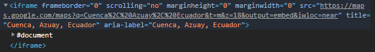
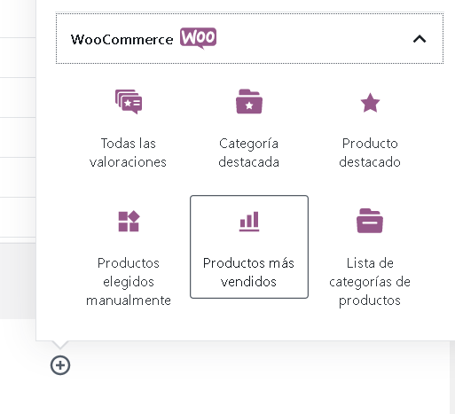
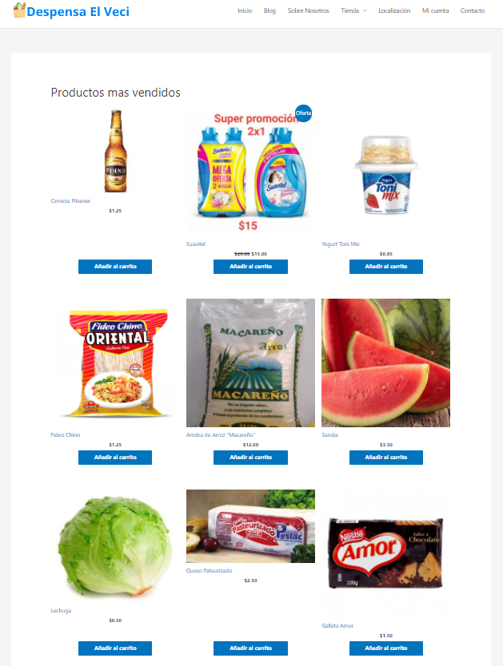

# Practica05-Mi-Tienda-Virtual
Despensa el veci-tienda online
||**VICERRECTORADO DOCENTE**|**Código:** GUIA-PRL-001|
| :- | :-: | :- |
||CONSEJO ACADÉMICO|**Aprobación:** 2016/04/06|
|**Formato:** Guía de Práctica de Laboratorio / Talleres / Centros de Simulación|

|

**PRÁCTICA DE LABORATORIO**
|
| - |
|**CARRERA**: COMPUTACION|**ASIGNATURA**: HIPERMEDIAL|
|**NRO. PRÁCTICA**:|5|**TÍTULO PRÁCTICA**: Implementación y despliegue de una tienda virtual usando WooCommerce|
|

**OBJETIVO**

- Diseñar adecuadamente elementos gráficos en sitios web en Internet.

- Crear sitios web aplicando estándares actuales.

- Desarrollar aplicaciones web interactivas y amigables al usuario.
|
|

**INSTRUCCIONES**
|

Se pide desarrollar una tienda virtual usando WordPress para montar un emprendimiento de un negocio local usando tecnología web. La tienda virtual debe presentar información sobre:

1. **¿A qué se dedica la empresa?**

Despensa el veci es un mini market que se dedica a la venta de productos de primera necesidad dentro del Ecuador, pues se ofrece una amplia gama de productos, ordenados por categorías, facilitando así la compra a nuestros clientes.

2. **¿Cuál es su público objetivo?**

Nuestro objetivo, es ofrecer a los Ecuatorianos, productos de calidad, a un precio asequible al bolsillo de los clientes, pues lo que se busca es satisfacer las necesidades básicas de los mismos, de una manera sencilla y rápida.

3. **¿Qué métodos de pago acepta?**

Aceptamos pagos por PayPal, en efectivo (Contrarrembolso)

4. **¿Cuáles son sus proveedores principales?**

Nuestros principales proveedores son:

•	Nestlé

•	La Italiana

•	Doña Petrona

•	La favorita

•	La Europea

•	Yupi

•	Coca-Cola

•	Colgate

•	Isabel

•	Toni

•	Oriental

•	La Nutri

•	Supan

5. **¿Cuáles son sus Clientes principales?**

Nuestros clientes principales en general son los ciudadanos de cuenca, ya que nuestra matriz está ubicado en esta ciudad, específicamente nuestros clientes más cotizados en esta ciudad, son los de la Remigio.

6. **¿Quiénes somos - Equipo de trabajo?**

Somos una empresa dedicada a ofrecer productos de primera necesidad, dentro del Ecuador, nuestra atención es 24/7, su mayor preocupación, será decidirse, en que pedir, ya que su pedido llegara de forma inmediata y segura a cualquier parte del Estado Ecuatoriano.

7. **Ubicación geográfica de la empresa, (sucursales, bodegas, oficinas, etc)**

Para la ubicación se usó Google maps, al compartir la ubicación se puede seleccionar una salida de código la cual luego debe ser insertado en un cuadro de código que el WordPress ofrece.

Esto lo hice con la ayuda del plugin Elementor, el cual me permite mostrar el siguiente diseño de ubicación:

8. **Preguntas frecuentes**

- **¿Cómo Comprar?** 

Antes de nada se sebe registrar, para poder obtener sus datos para la facturación, luego se debe buscar el producto deseado, en las diferentes categorías que existen, y por consiguiente se debe hacer clic en el botón del carrito, luego procedemos a seleccionar la forma de pago y damos clic en pagar, si todo está bien, pues el pedido será exitoso.

- **¿Cómo identifico los productos en oferta?**

En la página de inicio, se encontrara con una opción que muestra los productos en oferta, lo que se debe hacer es, dar clic, en donde dice “productos en oferta”, y lo redireccionará a una página mostrándole, lo antes mencionado.

- **¿Cómo busco un producto?** 

Los productos están almacenados en la opción tienda que se encuentra en el menú de la página, estos se encuentran ordenados por categoría, para una mejor navegación del usuario, o de igual manera se muestran las diferentes categorías de productos en la página de inicio, usted lo que debe hacer es dar clic sobre una de ellas, y se le desplegara los productos referente a la misma.

- **¿Qué opciones de pago hay?**

Los pagos que disponemos son por PayPal o en efectivo (Contrarrembolso), se recomienda hacerlo por PayPal, ya que es el método más seguro.

- **¿Qué pasa con los productos que dejo en el carrito?**

Los productos permanecerán en el carrito, siempre y cuando haya inventario disponible, de lo contrario te aparecerá un mensaje en el que informa que el producto se encuentra agotado y lo debes retirar.

- **¿Cuál es el monto de compra mínimo?**

No existe ningún monto de compra mínimo establecido.

9. **Formulario de contacto**

Para el Cuadro de formulario se usó el plugin Contact Form 7.

Desde este plugin se puede crear una tabla y luego se la puede referenciar desde un cuadro de texto al editar la página.

Una vez se crea la tabla se hace clic en incrustar y ahí se mostrará le código que referencia a esta tabla el cual luego se puede añadir en un cuadro de texto al editar la página para que esta aparezca ahí.

Lo copiamos y lo pegamos en nuestra página de formulario de contacto

Una vez guardado los cambios, se muestra así:

Además, la tienda virtual debe presentar sus productos organizados por categorías. La tienda debe tener ingresado al menos 20 productos con toda su información (descripción, fotografías, galería de imágenes, precios, etc)

También, se debe presentar los productos más vendidos y los productos con ofertas.

De igual manera, para poder finalizar un pedido el cliente debe iniciar sesión o crear una nueva cuenta.

La tienda virtual debe ser desplegada en un servidor en la nube (se debe buscar la opción gratuita y no es necesario que tenga un dominio específico).

La presentación de la tienda virtual se lo hará en formato pitch con un tiempo de 7 minutos.

https://[www.youtube.com/watch?v=dZRkny1t9oY](http://www.youtube.com/watch?v=dZRkny1t9oY) https://[www.youtube.com/watch?v=2b3xG_YjgvI](http://www.youtube.com/watch?v=2b3xG_YjgvI)
|
||
|**ACTIVIDADES POR DESARROLLAR**|
||

**Resolución CS N° 076-04-2016-04-20**

**Resolución CS N° 076-04-2016-04-20**

|1.	Crear un repositorio en GitHub con el nombre “Practica05 – Mi Tienda Virtual”|
| - |
|2.	Realizar un commit y push por cada requerimiento de los puntos antes descritos.|
|3.	Luego, se debe crear el archivo README del repositorio de GitHub.|
|
4. Generar informe de los resultados en el formato de prácticas. Debe incluir:

&emsp;a. Nombre de la base de datos (estructura de la base de datos)

Nombre de la base de datos (estructura de la base de datos) La base de datos de nuestra página comercial está bajo el nombre de “wordpress”, contiene un total de 43 tablas, a continuación, se muestra la estructura de las tablas más importantes.

**wpmz\_comments.** En esta tabla se guardan todos los comentarios realizados sobre nuestros productos.

**wpmz\_posts.** En esta tabla se guardan todos los posts realizados de la página.

**wpmz\_terms.** En esta tabla se guardan todas las etiquetas de nuestros productos.

**wpmz\_users.** En esta tabla se guardan los usuarios de nuestra página web.

**wpmz\_wc\_order\_stats.** Aquí se guarda la información de los pedidos realizados.

b. El desarrollo de cada uno de los requerimientos antes descritos.

Para el ingreso de productos, seleccionamos la pestaña de productos y desde ahí se pueden manejar todos los platillos que están ingresados y también da la posibilidad de agregar nuevos.

Para agregar a un producto dentro de una categoría se necesita crear una categoría y luego al estar creando un producto o editándolo simplemente marcar las categorías que el creador cree que es a la que pertenece el producto, estas categorías se pueden seleccionar desde un cuadro ubicado a la izquierda dentro del menú de creación/edición del producto.

Una vez que se creó las categorías, para agregar productos a esas categorías, se tiene que entrar en editar producto, en donde encontrará en la parte izquierda, todas las categorías, usted elija la que corresponde a dicho producto y listo.

Para lo que viene siendo los productos más vendidos del negocio, El Plugin WooCommerce nos ayuda en este aspecto, basta con añadir un cuadro y seleccionar “Productos más vendidos” dentro de la pestaña de WooCommerce (En este caso se lo añadió a la página de inicio). 

Una vez aplicado este plugin la página de los productos más vendidos se muestra así

`                                `Lo mismo seria para mostrar los productos que estén actualmente en oferta.

Una vez aplicado este plugin, la página de los productos más vendidos se muestra así

Al momento de la compra, WooCommerce se encarga de verificar si se está realizando la compra con un usuario registrado, en caso de que no lo esté el plugin impide la compra hasta que el usuario inicie sesión, para lograr esto se debe seleccionar los respectivos cuadros dentro de la pestaña de WooCommerce en ajustes.

Con esto se aplica en control necesario al momento de intentar comprar algo de la tienda.

Para poder desplegar la página se realizó con un dominio en internet gratuito, específicamente se realizó con la plataforma Infinityfree. El dominio conseguido está bajo el nombre de <https://minegocioups.epizy.com> y para publicar la página en ese dominio se debe acceder al menú de ajustes e introducir la dirección ahí.

c. **La evidencia del correcto diseño de las páginas HTML usando CSS. Para lo cual, se puede generar fotografías instantáneas (pantallazos).**

Para lo que viene siendo el CSS, al utilizar WordPress se nos facilita la aplicación de un CSS, desde la pestaña de Apariencia se escogió usar Astra, ya que es un tema limpio, que permite editar de forma gratuita, toda su estructura.

Al aplicarse se tuvieron que hacer cambios, como quitar la barra lateral izquierda, entre otros y para poder lograr la apariencia de la página deseada, se tuvo que utilizar el plugin elementor, el cual nos ayudó a nuestra página web, en este caso por bloques, como se puede ver en la imagen a continuación, pues existen uuna infinidad de bloques, ya se apara servicios, para mostrar proveedores o para mostrar los comentarios de los usuarios, entre otros, además en algunos casos se insertó plantillas de páginas, por ejemplo para el blog del sitio web

d. La evidencia del correcto funcionamiento de cada uno de los puntos requeridos.

- Así que quedo nuestra tienda de despensa de productos de primera necesidad

- Pagina de inicio

- Pagina del blog

- Pagina sobre nosotros

- Pagina de la tienda de productos, organizado por categorías

- Pagina de localización

- Pagina para crear cuentas de clientes

- Pagina de formulario de contacto

e. **El informe debe incluir conclusiones apropiadas.**

- La herramienta de wordpress, es muy poderosa, pues nos permite crear nuestro propio sitio web, si necesidad de saber programar, ni tener experiencia,  toda configuración de la estructura de la página, se lo hace con una interfaz gráfica, y pues gracias a los plugins, montar una tienda online es súper fácil, pues con el plugin woocommers, es el encargado de crear nuestra tienda online, dejándonos solo como trabajo, que productos agregar a la tienda y por supuesto que categorías.

- Woocomers, es el plugin más utilizado en la actualidad para e-commerce, ya que su interfaz es muy fácil de utilizar, y por qué nos ofrecen funcionas ya programadas, como mostrar los productos en oferta, o para también mostrar los productos más vendidos, pues esto hace que cualquier persona pueda emprender sin miedo ya que woocommers lo hace todo por ti. 

&emsp;f. **En el informe se debe incluir la información de GitHub (usuario y URL del repositorio de la práctica)**

g. **En el informe se debe incluir la firma digital de los estudiantes.**

|
|5.	En el archivo README del repositorio debe constar la misma información del informe de resultados de la práctica que se indica en el punto anterior.|
||
|
**RESULTADO(S) OBTENIDO(S)**:

- Tener el conocimiento suficiente para que el estudiante pueda entender y organizar de una mejor manera los sitios de web y de negocios en Internet
|
|
**CONCLUSIONES**:

- Los estudiantes podrán organizar sitios web basados en el lenguaje de programación PHP para persistir información en una base de datos relacional.
|
|
**RECOMENDACIONES**:

- Probar la solución de la práctica en al menos tres navegadores web; Google Chrome, Firefox y Safari
|

***Docente*:** Dr. Gabriel León Paredes, PhD.

***Firma*: **
